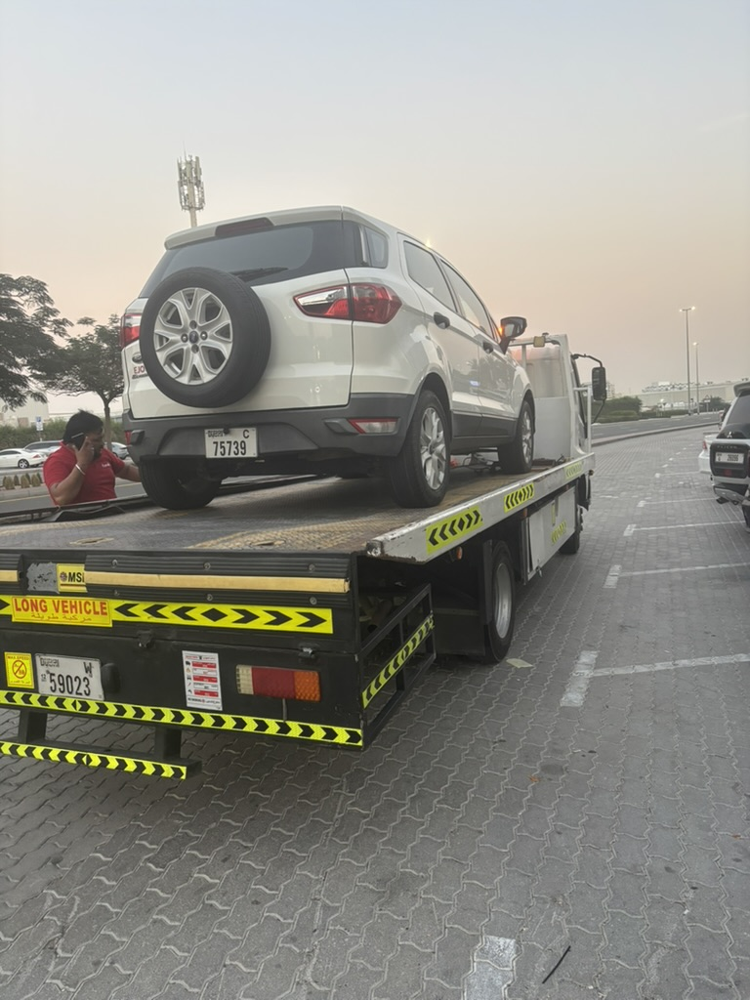
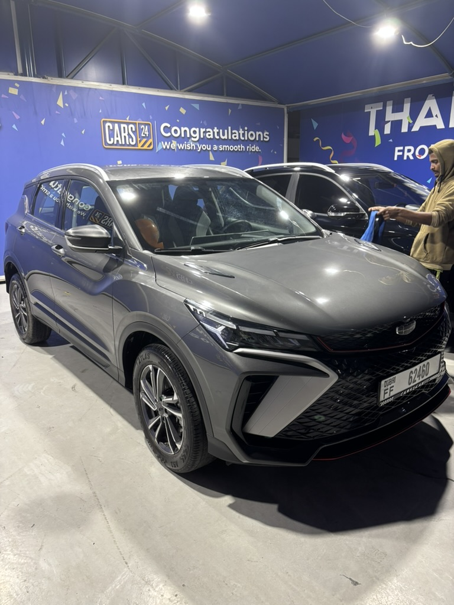
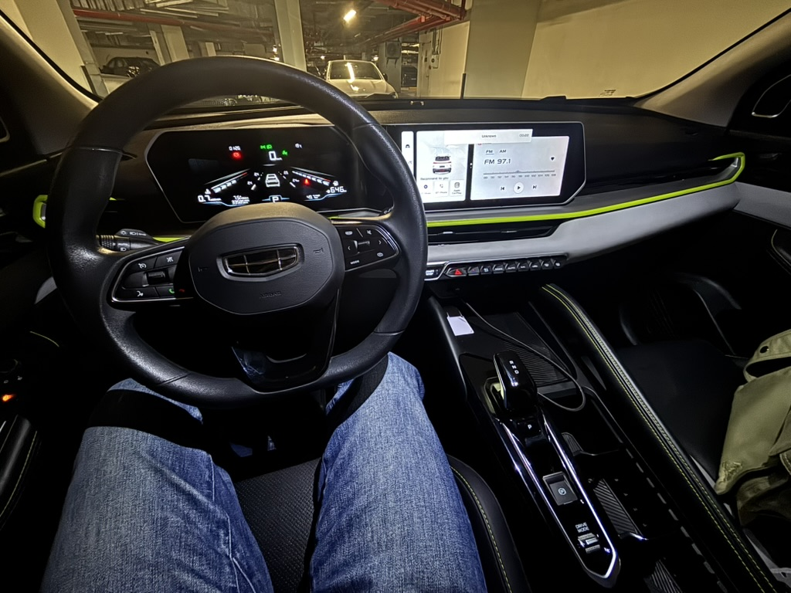
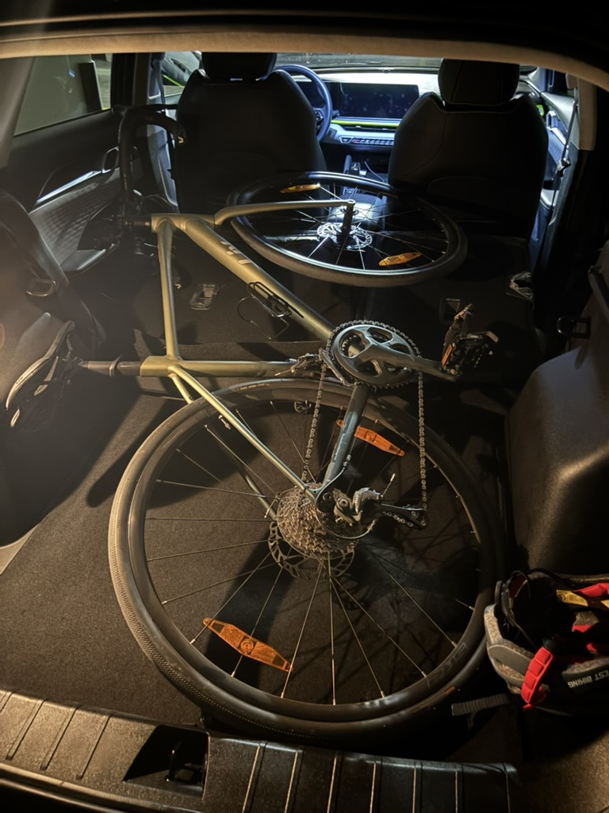
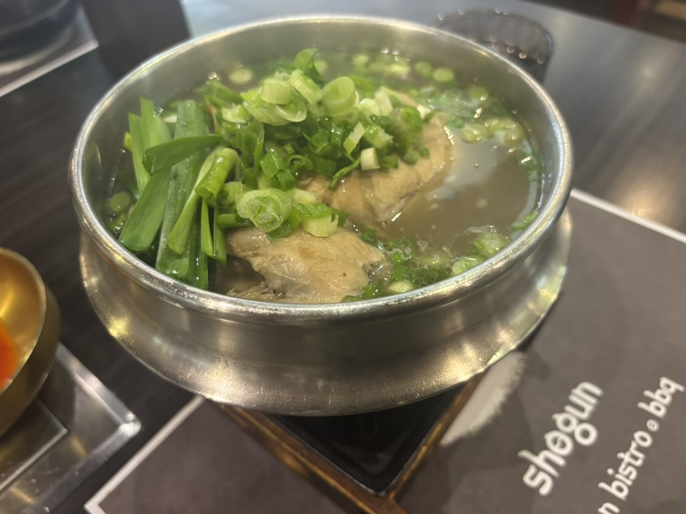

Hi.
Recently the weather is pretty cold. I know it's unbelievable but it's true.
It's not always hot even in Dubai. but of course I don't recommend vising here in summer

I bought a car from my colleague who was leaving Dubai.
It worked well for 3months but unfortunately it broke down a few days ago.
As you see it's quite old car that has been driven for 140k km.
But at least it was so helpful when I moved to a new house.
You did a good job my buddy. Good bye.

This is my new car. Even though it's not brand new, I'm so happy to have it.
Looking back, I never bought a car that I really wanted before.
As long as it was cheap and working fine, I was okay with it.
But this time I bought a car that I wanted.

It's not a big SUV, but it's pretty spacious for me.
But the most important thing is..

...the trunk size. I cycle every weekend, so I need to put my bike in the trunk.
Thank god. It fits perfectly. If it didn't fit, I would refund it as well

This is the holy place for cyclists in Dubai. The total course distance is over 100km. I usually ride 50km~70km every weekend.

https://www.google.com/maps/place/Al+Qudra+Cycle+Track+-+Al+Yalayis+3+-+Dubai/@24.9490549,55.2842585,13.11z/data=!4m6!3m5!1s0x3e5f7a72e6fac31b:0xb4fefcbefd74870e!8m2!3d24.9723542!4d55.3368269!16s%2Fg%2F12hk_zbt_?entry=ttu&g_ep=EgoyMDI2MDEyOC4wIKXMDSoASAFQAw%3D%3D

After working out. Taking protein is mandatory :)